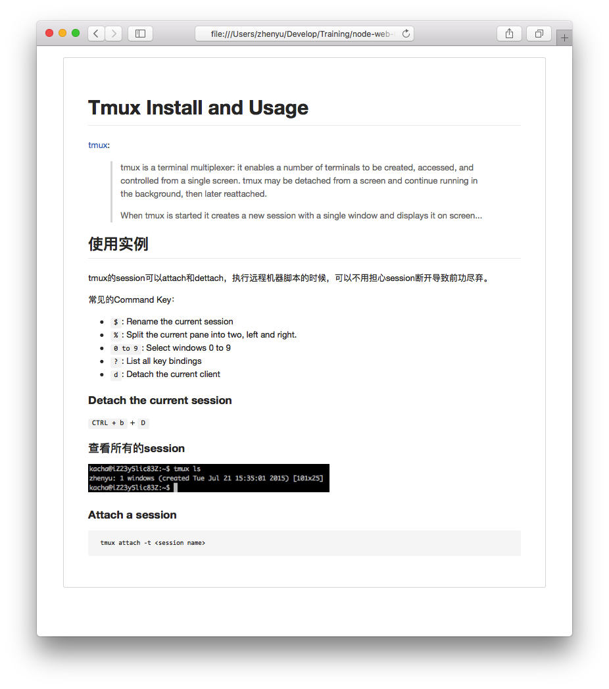

# CSS - Cascading Style Sheets

## 什么是CSS？

* 层叠样式表 (Cascading Style Sheets)。

> HTML 标签原本被设计为用于定义文档内容。通过使用 `<h1>` `
` 这样的标签，HTML 的初衷是表达“这是标题”、“这是段落”之类的信息。同时文档布局由浏览器来完成，而不使用任何的格式化标签。

> 由于两种主要的浏览器（Netscape 和 Internet Explorer）不断地将新的 HTML 标签和属性（比如字体标签和颜色属性）添加到 HTML 规范中，创建文档内容清晰地独立于文档表现层的站点变得越来越困难。	

> 为了解决这个问题，万维网联盟（W3C），这个非营利的标准化联盟，肩负起了 HTML 标准化的使命，并在 HTML 4.0 之外创造出样式（Style）。	

HTML负责文档内容和结构，CSS负责表现。

#### 示例一

	<head>
		<title>CSS Sample</title>
		
	</head>

打开[链接](./samples/css-basic.html)查看效果。

要点：
* 标签`

打开[链接](./samples/css-border.html)查看效果。

## CSS 语法

	selector {property: value; property: value; ...}

#### CSS选择器：Selector

* 元素选择器
* 类选择器
* ID选择器
* 属性选择器
* 后代选择器
* 子元素选择器
* 相邻兄弟选择器
* 伪类
* 伪元素

元素选择器

	h1 {color: red;}

类选择器

	h1.page-title {font-size: 36px;}
	span.name {font-weight: bold;}

ID选择器

	#name {color: red;}

属性选择器

	input[type=button] {width: 200px;}

后代选择器

	h1 em {color:red;}
	h1 .highlight {color: red;}

子元素选择器

	h1 > strong {color:red;}

相邻兄弟选择器

	h3 > p {color:red;}

伪类

	a:link {color: #FF0000}		/* 未访问的链接 */
	a:visited {color: #00FF00}	/* 已访问的链接 */
	a:hover {color: #FF00FF}	/* 鼠标移动到链接上 */
	a:active {color: #0000FF}	/* 选定的链接 */

伪元素

	p:first-letter {
		color:#ff0000;
		font-size:xx-large;
	}

选择器分组

	h2, p {color:gray;}

#### 练习

为HTML文档设置样式，使其按照下图展示。

## CSS 盒模型

* border
* margin
* padding
* height
* width

## 层叠次序

当同一个 HTML 元素被不止一个样式定义时，会使用哪个样式呢？

一般而言，所有的样式会根据下面的规则层叠于一个新的虚拟样式表中，其中数字 4 拥有最高的优先权。

* 浏览器缺省设置
* 外部样式表
* 内部样式表（位于 `<head>` 标签内部）
* 内联样式（在 HTML 元素内部）

## 选择器优先级计算

* Calculate the number of times the __ID__ attributes in the selector
* Calculate the number of times the __CLASS__ attributes in the selector
* Calculate the number of times the HTML tag names in the selector

HTML Snippet:

	<ul>
	  <li>
	    <ul>
	      <li class='thislist' id='thislist'>hello!</li>
	      <li></li>
	    </ul>
	  </li>
	  <li></li>
	</ul>

CSS Snippet:

	#thislist {color: black;} /*a: 1 b: 0 c: 0 = 100*/
	ul li ul li.thislist {color: green;} /*a: 0 b: 1 c: 4 = 014*/
	li.thislist {color: red;} /*a: 0 b: 1 c: 1 = 011*/
	li {color: blue;} /*a: 0 b: 0 c: 1 = 001*/

`!important`

	h1.title {color:#FFF !important;}

## CSS定位

#### display: block, inline, inline-block

请看[示例](./samples/css-display.html)。

#### 浮动

[W3School - CSS 浮动](http://www.w3school.com.cn/css/css_positioning_floating.asp)

## References

* [W3C School - 英文](http://www.w3schools.com/)
* [W3C School - 中文](http://www.w3school.com.cn)