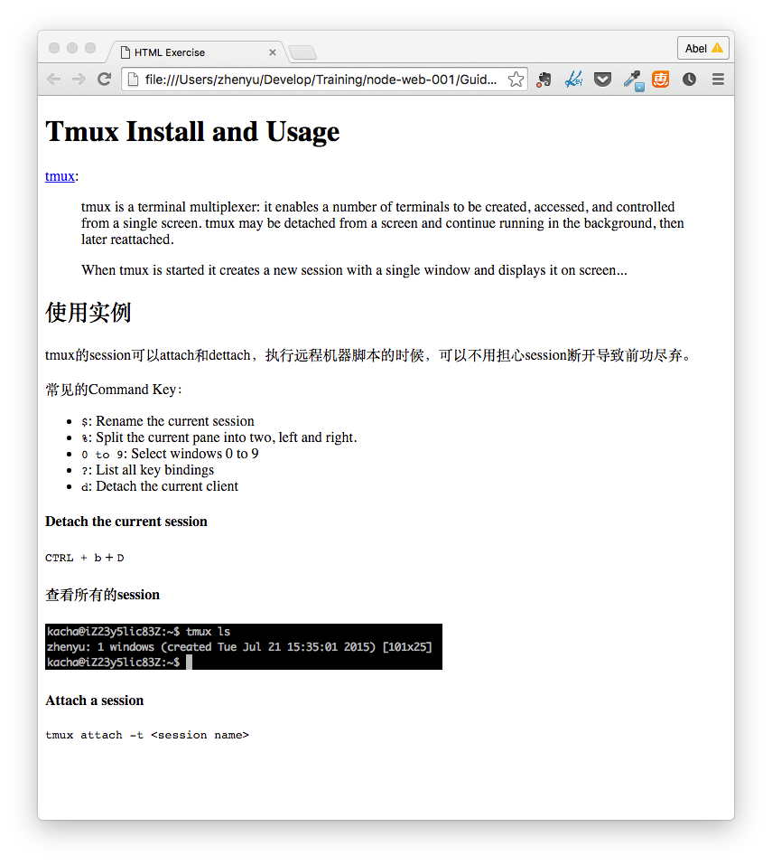

# HTML - Hyper Text Markup Language

## 什么是HTML？

#### 什么是浏览器？

[Wikipedia](https://en.wikipedia.org/wiki/Web_browser)中的定义：

>A web browser (commonly referred to as a browser) is a software application for retrieving, presenting, and traversing information resources on the World Wide Web. An information resource is identified by a Uniform Resource Identifier (URI/URL) and may be a web page, image, video or other piece of content. Hyperlinks present in resources enable users easily to navigate their browsers to related resources.

>Although browsers are primarily intended to use the World Wide Web, they can also be used to access information provided by web servers in private networks or files in file systems.

>The major web browsers are Firefox, Internet Explorer/Microsoft Edge, Google Chrome, Opera, and Safari.

关键词：

* URI/URL: Uniform Resource Identifier/Locator - 统一资源定位符
	
		scheme:[//[user:password@]host[:port]][/]path[?query][#fragment]

* Hyperlinks: 超链接

[浏览器具备的功能](https://en.wikipedia.org/wiki/Web_browser#Function) - from Wikipedia：

>The primary purpose of a web browser is to bring information resources to the user ("retrieval" or "fetching"), allowing them to view the information ("display", "rendering"), and then access other information ("navigation", "following links").

>This process begins when the user inputs a Uniform Resource Locator (URL), for example http://en.wikipedia.org/, into the browser. The prefix of the URL, the Uniform Resource Identifier or URI, determines how the URL will be interpreted. The most commonly used kind of URI starts with http: and identifies a resource to be retrieved over the Hypertext Transfer Protocol (HTTP). Many browsers also support a variety of other prefixes, such as https: for HTTPS, ftp: for the File Transfer Protocol, and file: for local files. 

>In the case of http, https, file, and others, once the resource has been retrieved the web browser will display it. HTML and associated content (image files, formatting information such as CSS, etc.) is passed to the browser's layout engine to be transformed from markup to an interactive document, a process known as "rendering". Aside from HTML, web browsers can generally display any kind of content that can be part of a web page. Most browsers can display images, audio, video, and XML files, and often have plug-ins to support Flash applications and Java applets. Upon encountering a file of an unsupported type or a file that is set up to be downloaded rather than displayed, the browser prompts the user to save the file to disk.

>Information resources may contain hyperlinks to other information resources. Each link contains the URI of a resource to go to. When a link is clicked, the browser navigates to the resource indicated by the link's target URI, and the process of bringing content to the user begins again.

概括：
* 获取、展示信息
* 输入：URL
* 渲染 HTML文档
* 浏览器和HTML的关系

#### HTML是什么？

* 超文本标记语言 (Hyper Text Markup Language)
* HTML文档可以用任何文本编辑器打开和编辑

#### 一个简单的例子

	<html>
	<head>
		<title>Basic HTML</title>
		<meta charset="UTF-8">
	</head>
	<body>

	<!-- Headings -->
	<h1>My First Heading 1</h1>
	<h2>My First Heading 2</h2>
	<h3>My First Heading 3</h3>

	<!-- Paragraphs -->
	
My first paragraph.

	

		<!-- Unordered list -->
		Good Tutorial:
		<ul>
			<li><a href="http://www.w3school.com.cn">W3School (Chinese)</a></li>
			<li><a href="http://www.w3schools.com/html/default.asp">W3School (English)</a></li>
		</ul>
	

	</body>
	</html>

打开[链接](./samples/basic.html)查看效果。

要点：
* 标签
* 注释
* 文档结构
* 标签嵌套
* 属性（Attribute）

## Tips

#### HTML字符集

字符集简介：
* ASCII
* ISO-8859-1 （HTML默认编码）
* UTF-8
* GBK

声明字符集：

	For HTML4:
	<meta http-equiv="Content-Type" content="text/html;charset=ISO-8859-1">

	For HTML5:
	<meta charset="UTF-8">

需转义的特殊字符：

	'<' -> &lt;
	'>' -> &gt;

#### 浏览器解释HTML文档时会忽略空白符

* 换行
* 空格

换行可以用 ，标签间空格可以通过转义字符 `&nbsp;`, 但不建议使用。一般通过CSS样式控制.

## 练习

* 自己编写一个HTML文件，在浏览器中查看效果。尝试[W3C School - Tags](http://www.w3school.com.cn/tags/index.asp)中的标签，例如：a，p，div，img，input，ul，ol。
* tmux-intro：编写html页面，展现下图内容

## References

* [W3C School - 英文](http://www.w3schools.com/)
* [W3C School - 中文](http://www.w3school.com.cn)
